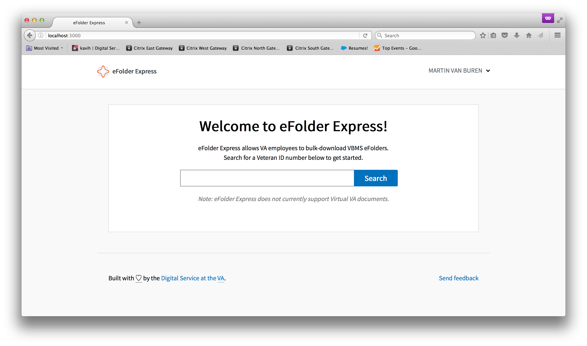

# Caseflow - eFolder Express

## About

FOIA Requests that give veterans access to their own VA files take **way** too long right now. eFolder Express allows VA employees to download all of a veteran's files in a fraction of the time it currently takes. It will also enable attorneys in the appeals process to use best-in-class legal tools to review these documents and so they can provide excellent service to America's veterans.

## First Time Development Setup

You'll need Ruby 2.3.0, Postgres, and Redis if you don't have them.

> $ rbenv install 2.3.0
> $ brew install postgresql
> $ brew install redis

You may want to have Redis and Postgres run on startup. Let brew tell you how to do that:

> $ brew info redis
> $ brew info postgresql

Install dependencies

> $ bundle install

Create the database

> $ rake db:create

Load the schema

> $ rake db:schema:load

You'll also need to install `redis`. Follow the post-install instructions to start the redis server.

> $ brew install redis

Now start both the rails server,

> $ rails s

And in a seperate terminal, start a jobs worker

> $ bundle exec sidekiq

If you want to test out the DEMO flow (without VBMS connection),

Visit [http://localhost:3000](),
Type in a file number with "DEMO" in it. (ie: "DEMO123")
Watch it download your fake file.

### Setting up VBMS

TODO: fill this out
You'll need to add all the VBMS info to your `config/secrets.yml`.
